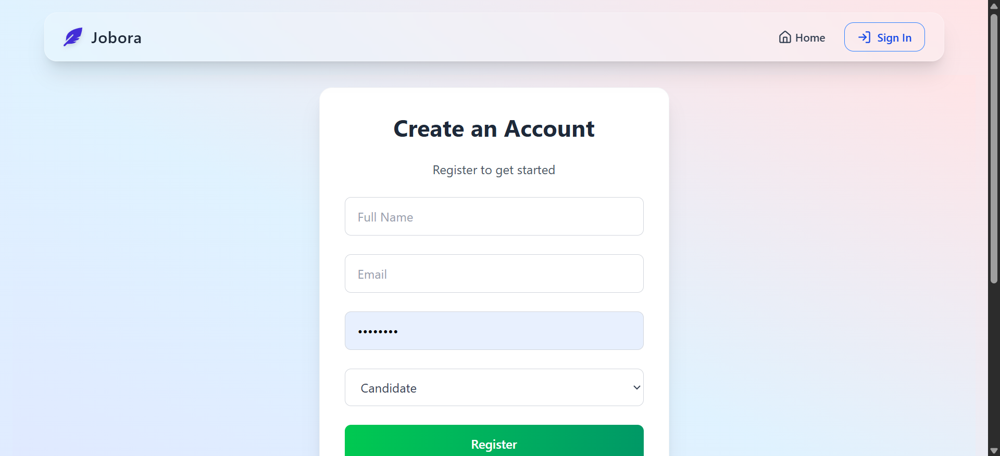

# 🌟 Jobora – Your Career Starts Here

> A sleek job listing web app where recruiters post jobs and applicants apply seamlessly. Built with 💙 React + PHP + MySQL.


---

## 🚀 Features

- 🧰 **Post a Job** – Recruiters can easily publish job openings.
- 👀 **Browse Jobs** – Applicants can view listings with details.
- 📩 **Apply Now** – Submit name, email, phone & resume.
- 📬 **Submissions Dashboard** – Admin view with accept/reject & mail integration.
- 📧 **Email Notification** – Applicants get selected/rejected mail instantly.
- ✨ **Modern UI** – Clean, responsive interface with animations.
- 🔐 **Secure Backend** – Built with PHP, MySQL and PHPMailer.

---

## 🖼️ Screenshots

### 🏠 Home Page


### 📄 Job Listing


### 📝 Post a Job


### 📥 Application Form


### 📊 Submissions Dashboard


---

## 🛠️ Tech Stack

- **Frontend**: React + Tailwind CSS + Vite
- **Backend**: PHP + MySQL
- **Email**: PHPMailer + SMTP
- **State**: React `useState`, `useEffect`, Global Store (optional)
- **Animations**: Framer Motion

---

## 📁 Project Structure (Important)

frontend/
├── public/
├── src/
│ ├── assets/
│ ├── components/
│ ├── screenshots/ 📸 ← All screenshots for README
│ ├── store/
│ ├── App.jsx
│ ├── main.jsx
│ └── index.css
backend/
├── database.php
├── apply.php
├── update_status.php
├── get_applications.php
├── vendor/ 📦 ← PHPMailer via Composer

yaml
Copy
Edit

---

## 💌 Email Integration

- Status updates (Accept/Reject) send mail via `PHPMailer`
- Uses environment variables from `.env` for SMTP credentials
- Secure and configurable

---

## 🔧 Setup Instructions

```bash
# 1. Install PHP & MySQL (XAMPP recommended)
# 2. Run PHP backend in /backend (localhost:8080 or similar)
# 3. Setup .env with your mail credentials
# 4. Start React frontend
cd frontend
npm install
npm run dev
📬 Contact
💻 Developed by Sanju Devadas

✉️ sanjudevadas11@gmail.com

🔗 Telegram: @sanjyou (optional)

⭐ Show your Support
If you like this project, give it a ⭐ on GitHub and feel free to contribute!

